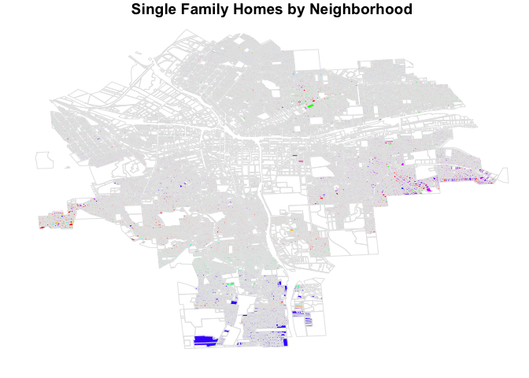
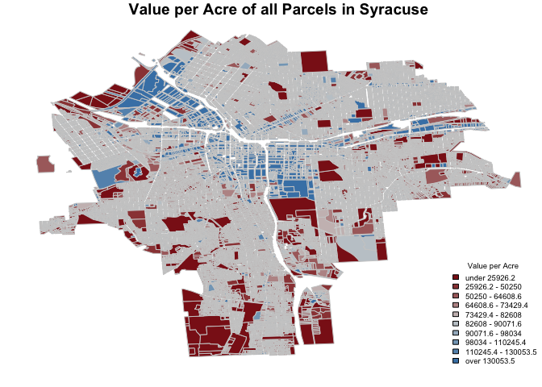
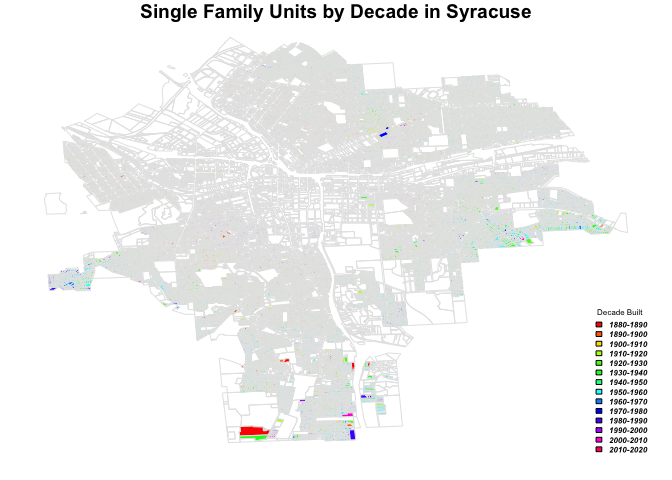

Lab4-DM-II
================
Alejandro Alfaro
2/16/2017

### Question 1: How many single family homes are in each neighborhood?

<table style="width:51%;">
<colgroup>
<col width="33%" />
<col width="18%" />
</colgroup>
<thead>
<tr class="header">
<th align="center">Nhood</th>
<th align="center">ParcelCount</th>
</tr>
</thead>
<tbody>
<tr class="odd">
<td align="center">Eastwood</td>
<td align="center">3603</td>
</tr>
<tr class="even">
<td align="center">Court-Woodlawn</td>
<td align="center">1855</td>
</tr>
<tr class="odd">
<td align="center">Meadowbrook</td>
<td align="center">1721</td>
</tr>
<tr class="even">
<td align="center">South Valley</td>
<td align="center">1605</td>
</tr>
<tr class="odd">
<td align="center">Northside</td>
<td align="center">1500</td>
</tr>
<tr class="even">
<td align="center">Strathmore</td>
<td align="center">1472</td>
</tr>
<tr class="odd">
<td align="center">Brighton</td>
<td align="center">1397</td>
</tr>
<tr class="even">
<td align="center">North Valley</td>
<td align="center">1191</td>
</tr>
<tr class="odd">
<td align="center">Salt Springs</td>
<td align="center">1026</td>
</tr>
<tr class="even">
<td align="center">Elmwood</td>
<td align="center">904</td>
</tr>
<tr class="odd">
<td align="center">Sedgwick</td>
<td align="center">892</td>
</tr>
<tr class="even">
<td align="center">Westcott</td>
<td align="center">851</td>
</tr>
<tr class="odd">
<td align="center">University Neighborhood</td>
<td align="center">801</td>
</tr>
<tr class="even">
<td align="center">Tipp Hill</td>
<td align="center">783</td>
</tr>
<tr class="odd">
<td align="center">Outer Comstock</td>
<td align="center">697</td>
</tr>
<tr class="even">
<td align="center">Lincoln Hill</td>
<td align="center">578</td>
</tr>
<tr class="odd">
<td align="center">Near Westside</td>
<td align="center">514</td>
</tr>
<tr class="even">
<td align="center">Southside</td>
<td align="center">479</td>
</tr>
<tr class="odd">
<td align="center">Far Westside</td>
<td align="center">469</td>
</tr>
<tr class="even">
<td align="center">Washington Square</td>
<td align="center">421</td>
</tr>
<tr class="odd">
<td align="center">Southwest</td>
<td align="center">416</td>
</tr>
<tr class="even">
<td align="center">Winkworth</td>
<td align="center">411</td>
</tr>
<tr class="odd">
<td align="center">Skunk City</td>
<td align="center">338</td>
</tr>
<tr class="even">
<td align="center">Park Ave.</td>
<td align="center">161</td>
</tr>
<tr class="odd">
<td align="center">Near Eastside</td>
<td align="center">92</td>
</tr>
<tr class="even">
<td align="center">Hawley-Green</td>
<td align="center">52</td>
</tr>
<tr class="odd">
<td align="center">Prospect Hill</td>
<td align="center">29</td>
</tr>
<tr class="even">
<td align="center">South Campus</td>
<td align="center">25</td>
</tr>
<tr class="odd">
<td align="center">Lakefront</td>
<td align="center">24</td>
</tr>
<tr class="even">
<td align="center">University Hill</td>
<td align="center">17</td>
</tr>
<tr class="odd">
<td align="center">Downtown</td>
<td align="center">1</td>
</tr>
</tbody>
</table>

### Question 2: Where does land in Syracuse have the highest value?

<table style="width:58%;">
<colgroup>
<col width="33%" />
<col width="25%" />
</colgroup>
<thead>
<tr class="header">
<th align="center">Nhood</th>
<th align="center">AspercentOfTotal</th>
</tr>
</thead>
<tbody>
<tr class="odd">
<td align="center">Sedgwick</td>
<td align="center">14.57</td>
</tr>
<tr class="even">
<td align="center">University Hill</td>
<td align="center">5.88</td>
</tr>
<tr class="odd">
<td align="center">Meadowbrook</td>
<td align="center">3.49</td>
</tr>
<tr class="even">
<td align="center">Winkworth</td>
<td align="center">2.68</td>
</tr>
<tr class="odd">
<td align="center">University Neighborhood</td>
<td align="center">2.12</td>
</tr>
<tr class="even">
<td align="center">Lincoln Hill</td>
<td align="center">1.21</td>
</tr>
<tr class="odd">
<td align="center">Strathmore</td>
<td align="center">1.09</td>
</tr>
<tr class="even">
<td align="center">Outer Comstock</td>
<td align="center">0.43</td>
</tr>
<tr class="odd">
<td align="center">South Valley</td>
<td align="center">0.31</td>
</tr>
<tr class="even">
<td align="center">Northside</td>
<td align="center">0.13</td>
</tr>
<tr class="odd">
<td align="center">Eastwood</td>
<td align="center">0.03</td>
</tr>
</tbody>
</table>

### Question 3: What is the age of single family homes in each neighborhood?

<table style="width:93%;">
<caption>Table continues below</caption>
<colgroup>
<col width="33%" />
<col width="25%" />
<col width="34%" />
</colgroup>
<thead>
<tr class="header">
<th align="center">Nhood</th>
<th align="center">TenthPercentile</th>
<th align="center">TwentiethFivePercentile</th>
</tr>
</thead>
<tbody>
<tr class="odd">
<td align="center">Eastwood</td>
<td align="center">61</td>
<td align="center">73</td>
</tr>
<tr class="even">
<td align="center">Court-Woodlawn</td>
<td align="center">63</td>
<td align="center">73</td>
</tr>
<tr class="odd">
<td align="center">Meadowbrook</td>
<td align="center">56</td>
<td align="center">61</td>
</tr>
<tr class="even">
<td align="center">South Valley</td>
<td align="center">53</td>
<td align="center">61</td>
</tr>
<tr class="odd">
<td align="center">Northside</td>
<td align="center">86</td>
<td align="center">96</td>
</tr>
<tr class="even">
<td align="center">Strathmore</td>
<td align="center">60</td>
<td align="center">80</td>
</tr>
<tr class="odd">
<td align="center">Brighton</td>
<td align="center">61</td>
<td align="center">86</td>
</tr>
<tr class="even">
<td align="center">North Valley</td>
<td align="center">56</td>
<td align="center">61</td>
</tr>
<tr class="odd">
<td align="center">Salt Springs</td>
<td align="center">54</td>
<td align="center">61</td>
</tr>
<tr class="even">
<td align="center">Elmwood</td>
<td align="center">60</td>
<td align="center">81</td>
</tr>
<tr class="odd">
<td align="center">Sedgwick</td>
<td align="center">63</td>
<td align="center">73</td>
</tr>
<tr class="even">
<td align="center">Westcott</td>
<td align="center">61</td>
<td align="center">81</td>
</tr>
<tr class="odd">
<td align="center">University Neighborhood</td>
<td align="center">64</td>
<td align="center">70</td>
</tr>
<tr class="even">
<td align="center">Tipp Hill</td>
<td align="center">77</td>
<td align="center">91</td>
</tr>
<tr class="odd">
<td align="center">Outer Comstock</td>
<td align="center">51</td>
<td align="center">57</td>
</tr>
<tr class="even">
<td align="center">Lincoln Hill</td>
<td align="center">31</td>
<td align="center">86</td>
</tr>
<tr class="odd">
<td align="center">Near Westside</td>
<td align="center">16</td>
<td align="center">27</td>
</tr>
<tr class="even">
<td align="center">Southside</td>
<td align="center">23</td>
<td align="center">86</td>
</tr>
<tr class="odd">
<td align="center">Far Westside</td>
<td align="center">86</td>
<td align="center">96</td>
</tr>
<tr class="even">
<td align="center">Washington Square</td>
<td align="center">86</td>
<td align="center">96</td>
</tr>
<tr class="odd">
<td align="center">Southwest</td>
<td align="center">16</td>
<td align="center">23</td>
</tr>
<tr class="even">
<td align="center">Winkworth</td>
<td align="center">45</td>
<td align="center">56</td>
</tr>
<tr class="odd">
<td align="center">Skunk City</td>
<td align="center">55</td>
<td align="center">86</td>
</tr>
<tr class="even">
<td align="center">Park Ave.</td>
<td align="center">86</td>
<td align="center">96</td>
</tr>
<tr class="odd">
<td align="center">Near Eastside</td>
<td align="center">73</td>
<td align="center">81</td>
</tr>
<tr class="even">
<td align="center">Hawley-Green</td>
<td align="center">87</td>
<td align="center">106</td>
</tr>
<tr class="odd">
<td align="center">Prospect Hill</td>
<td align="center">74</td>
<td align="center">86</td>
</tr>
<tr class="even">
<td align="center">South Campus</td>
<td align="center">30</td>
<td align="center">51</td>
</tr>
<tr class="odd">
<td align="center">Lakefront</td>
<td align="center">88</td>
<td align="center">96</td>
</tr>
<tr class="even">
<td align="center">University Hill</td>
<td align="center">72</td>
<td align="center">86</td>
</tr>
<tr class="odd">
<td align="center">Downtown</td>
<td align="center">88</td>
<td align="center">88</td>
</tr>
</tbody>
</table>

<table>
<colgroup>
<col width="25%" />
<col width="30%" />
<col width="27%" />
<col width="16%" />
</colgroup>
<thead>
<tr class="header">
<th align="center">FiftiethPercentile</th>
<th align="center">SeventyFifthPercentile</th>
<th align="center">NinetiethPercentile</th>
<th align="center">ParcelCount</th>
</tr>
</thead>
<tbody>
<tr class="odd">
<td align="center">86</td>
<td align="center">96</td>
<td align="center">101</td>
<td align="center">3603</td>
</tr>
<tr class="even">
<td align="center">87</td>
<td align="center">96</td>
<td align="center">116</td>
<td align="center">1855</td>
</tr>
<tr class="odd">
<td align="center">66</td>
<td align="center">84</td>
<td align="center">90</td>
<td align="center">1721</td>
</tr>
<tr class="even">
<td align="center">66</td>
<td align="center">86</td>
<td align="center">96</td>
<td align="center">1605</td>
</tr>
<tr class="odd">
<td align="center">106</td>
<td align="center">116</td>
<td align="center">126</td>
<td align="center">1500</td>
</tr>
<tr class="even">
<td align="center">90</td>
<td align="center">96</td>
<td align="center">108</td>
<td align="center">1472</td>
</tr>
<tr class="odd">
<td align="center">96</td>
<td align="center">106</td>
<td align="center">116</td>
<td align="center">1397</td>
</tr>
<tr class="even">
<td align="center">81</td>
<td align="center">91</td>
<td align="center">104</td>
<td align="center">1191</td>
</tr>
<tr class="odd">
<td align="center">76</td>
<td align="center">88</td>
<td align="center">96</td>
<td align="center">1026</td>
</tr>
<tr class="even">
<td align="center">88</td>
<td align="center">96</td>
<td align="center">116</td>
<td align="center">904</td>
</tr>
<tr class="odd">
<td align="center">86</td>
<td align="center">94</td>
<td align="center">106</td>
<td align="center">892</td>
</tr>
<tr class="even">
<td align="center">91</td>
<td align="center">99</td>
<td align="center">116</td>
<td align="center">851</td>
</tr>
<tr class="odd">
<td align="center">88</td>
<td align="center">96</td>
<td align="center">106</td>
<td align="center">801</td>
</tr>
<tr class="even">
<td align="center">106</td>
<td align="center">116</td>
<td align="center">126</td>
<td align="center">783</td>
</tr>
<tr class="odd">
<td align="center">66</td>
<td align="center">75</td>
<td align="center">91</td>
<td align="center">697</td>
</tr>
<tr class="even">
<td align="center">96</td>
<td align="center">116</td>
<td align="center">126</td>
<td align="center">578</td>
</tr>
<tr class="odd">
<td align="center">96</td>
<td align="center">116</td>
<td align="center">135</td>
<td align="center">514</td>
</tr>
<tr class="even">
<td align="center">96</td>
<td align="center">115</td>
<td align="center">116</td>
<td align="center">479</td>
</tr>
<tr class="odd">
<td align="center">106</td>
<td align="center">116</td>
<td align="center">126</td>
<td align="center">469</td>
</tr>
<tr class="even">
<td align="center">116</td>
<td align="center">136</td>
<td align="center">156</td>
<td align="center">421</td>
</tr>
<tr class="odd">
<td align="center">86</td>
<td align="center">106</td>
<td align="center">116</td>
<td align="center">416</td>
</tr>
<tr class="even">
<td align="center">61</td>
<td align="center">68</td>
<td align="center">86</td>
<td align="center">411</td>
</tr>
<tr class="odd">
<td align="center">96</td>
<td align="center">116</td>
<td align="center">126</td>
<td align="center">338</td>
</tr>
<tr class="even">
<td align="center">106</td>
<td align="center">116</td>
<td align="center">126</td>
<td align="center">161</td>
</tr>
<tr class="odd">
<td align="center">96</td>
<td align="center">111</td>
<td align="center">126</td>
<td align="center">92</td>
</tr>
<tr class="even">
<td align="center">116</td>
<td align="center">126</td>
<td align="center">145</td>
<td align="center">52</td>
</tr>
<tr class="odd">
<td align="center">96</td>
<td align="center">116</td>
<td align="center">129</td>
<td align="center">29</td>
</tr>
<tr class="even">
<td align="center">59</td>
<td align="center">70</td>
<td align="center">88</td>
<td align="center">25</td>
</tr>
<tr class="odd">
<td align="center">111</td>
<td align="center">126</td>
<td align="center">136</td>
<td align="center">24</td>
</tr>
<tr class="even">
<td align="center">96</td>
<td align="center">106</td>
<td align="center">113</td>
<td align="center">17</td>
</tr>
<tr class="odd">
<td align="center">88</td>
<td align="center">88</td>
<td align="center">88</td>
<td align="center">1</td>
</tr>
</tbody>
</table>

