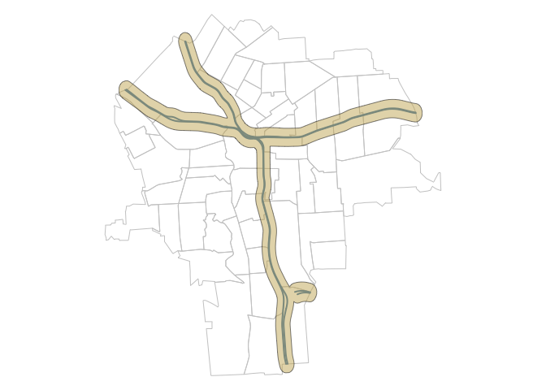
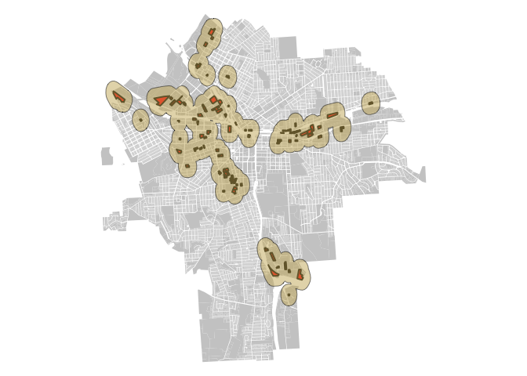
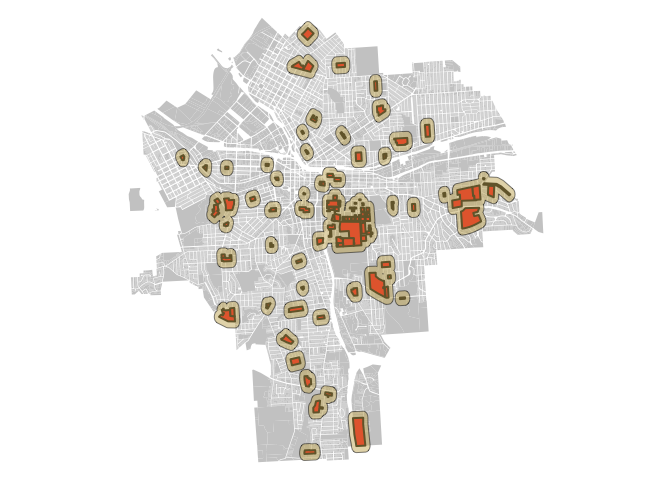

Lab\_6
================
Alejandro Alfaro
3/09/2017

``` r
# Part 1:

## (1)  Download the Tiger shapefiles for Onondaga County census tracts and primary and secondary roads (see attached). Plot both together, highlighting interstates.
dir.create( "shapefiles" )
setwd( "./shapefiles" )
download.file("ftp://ftp2.census.gov/geo/tiger/TIGER2010/TRACT/2010/tl_2010_36067_tract10.zip", "onondaga census tracts.zip" )
unzip( "onondaga census tracts.zip" )
file.remove( "onondaga census tracts.zip" )
```

    ## [1] TRUE

``` r
syr <- readShapePoly( fn="tl_2010_36067_tract10", proj4string=CRS("+proj=longlat +datum=WGS84") )
syr <- syr[ as.numeric(as.character(syr$NAME10)) < 64 , ] # keep only tracts in the city

### ADD ROADS
download.file("ftp://ftp2.census.gov/geo/tiger/TIGER2015/PRISECROADS/tl_2015_36_prisecroads.zip", "primary_and_secondary_roads.zip" )
unzip( "primary_and_secondary_roads.zip" )
file.remove( "primary_and_secondary_roads.zip" )
```

    ## [1] TRUE

``` r
roads <- readShapeLines( fn="tl_2015_36_prisecroads", proj4string=CRS("+proj=longlat +datum=WGS84") )
roads <- roads[ roads$RTTYP == "I" , ] # keep only interstates

## Clipping roads

clipped_roads <- gIntersection( syr, roads )

## (4)  Create a buffer of approximately a quarter mile (eyeball this) from the interstate, and identify all houses that fall within this zone.

buff1 <- gBuffer( clipped_roads, width=.0025, byid=T )
par( mar=c(0,0,0,0) )
plot( syr,  border="gray80" )
plot( clipped_roads, col="steelblue", lwd=2, add=T )
plot(buff1, col=rgb( red=0.8, blue=0.4, green=0.7, alpha=0.5 ),lwd=.5, add=T)
```



``` r
## (5)  Add a new categorical variable to the houses dataset that indicates whether it falls within the buffer zone or not. 
dathouse <- read.csv("https://raw.githubusercontent.com/R-Class/all-labs-ddmii-aalfaroa/master/Lab5/HousingData_All.csv")
lon.lat <- dathouse[ , c("lon","lat") ]
lon.lat <- SpatialPoints(lon.lat, proj4string = CRS("+proj=longlat +datum=WGS84") )
poly.data.matched.to.points <- over( lon.lat, buff1 )
dathouse <- cbind( dathouse, poly.data.matched.to.points )
names(dathouse)[names(dathouse)=="poly.data.matched.to.points"] <- "Interstatebuff"
rm(poly.data.matched.to.points)

# Part 2:

## (1) Create a buffer a quarter mile from industrial zones (LandUse).  Create a plot to highlight your buffer zone.
link <- "https://raw.githubusercontent.com/lecy/geojson/master/syr_parcels.geojson"
syrland <- readOGR(dsn=link, layer="OGRGeoJSON")
```

    ## OGR data source with driver: GeoJSON 
    ## Source: "https://raw.githubusercontent.com/lecy/geojson/master/syr_parcels.geojson", layer: "OGRGeoJSON"
    ## with 41502 features
    ## It has 64 fields

``` r
syrindustrial <- syrland[syrland$LandUse == "Industrial",]
buff2 <- gBuffer( syrindustrial, width=.003)
par( mar=c(0,0,0,0) )
plot( syrland,  border=F, col = "grey80")
plot( syrindustrial, col="red", lwd=2, add=T)
plot(buff2, col=rgb( red=0.8, blue=0.4, green=0.7, alpha=0.5 ),lwd=.5, add=T)
```



``` r
## (2) Identify houses within the buffer zone and create a categorical variable in the dataset indicating proximity to industrial zones.
lon.lat <- dathouse[ , c("lon","lat") ]
lon.lat <- SpatialPoints(lon.lat, proj4string = CRS("+proj=longlat +datum=WGS84 +ellps=WGS84 +towgs84=0,0,0 ") )
buff2 <- spTransform(buff2, CRS(proj4string(lon.lat)))
poly.data.matched.to.points <- over( lon.lat, buff2 )
dathouse <- cbind( dathouse, poly.data.matched.to.points )
names(dathouse)[names(dathouse)=="poly.data.matched.to.points"] <- "Industrialbuff"
rm(poly.data.matched.to.points)

##(3)   Create a buffer zone an eighth of a mile from schools. Create a plot go highlight these buffer zones.
syrschools <- syrland[syrland$LandUse == "Schools",]
buff3 <- gBuffer(syrschools, width=.0015)
par( mar=c(0,0,0,0) )
plot( syrland,  border=F, col = "grey80")
plot( syrschools, col="red", lwd=2, add=T)
plot(buff3, col=rgb( red=0.8, blue=0.4, green=0.7, alpha=0.5 ),lwd=.5, add=T)
```



``` r
##(4)   Identify houses within the buffer zone and create a categorical variable in the dataset indicating proximity to schools.
buff3 <- spTransform(buff3, CRS(proj4string(lon.lat)))
poly.data.matched.to.points <- over( lon.lat, buff3 )
dathouse <- cbind( dathouse, poly.data.matched.to.points )
names(dathouse)[names(dathouse)=="poly.data.matched.to.points"] <- "Schoolbuff"
rm(poly.data.matched.to.points)
write.csv(dathouse, file="dathouse_all.csv")
head(dathouse, 5)
```

    ##   X TRACTCE10       timestamp  price X1 X2 sqft      your.name lot.size
    ## 1 1      4800 1/15/2015 16:11 179900 NA NA 1600 Emily Simonson    43560
    ## 2 2      4800 1/15/2015 16:17 128000 NA NA 1992 Emily Simonson     6969
    ## 3 3      4800 1/15/2015 16:25 114900 NA NA 1378 Emily Simonson     5227
    ## 4 4      4800 1/15/2015 16:34 107500 NA NA 1452 Emily Simonson     5227
    ## 5 5      4800 1/15/2015 16:41  43000 NA NA  850 Emily Simonson     6098
    ##   beds bath garage year elementary middle high walk  tax highway
    ## 1    3  2.0    Yes 1994          9      4    2   15 3182      No
    ## 2    4  2.5    Yes 1950          2      4    2   43 1393      No
    ## 3    4  1.0    Yes 1930          2      4    2   50 1331      No
    ## 4    3  1.0    Yes 1931          2      4    1   42  157      No
    ## 5    2  1.0    Yes 1955          2      9    1   57 1525      No
    ##   restaurant starbucks park mall            address   zip       lon
    ## 1         22       3.2   18  1.3 504 Winkworth Pkwy 13219 -76.19918
    ## 2          7       2.6    5  0.6     136 Austin Ave 13207 -76.18848
    ## 3          6       2.6    7  0.5     701 Velasko Rd 13207 -76.18540
    ## 4         12       2.6    8  0.8    518 Wolcott Ave 13207 -76.18301
    ## 5          8       2.3   20  0.6    112 Wolcott Ave 13207 -76.18324
    ##        lat tract STATEFP10 COUNTYFP10    GEOID10 NAME10      NAMELSAD10
    ## 1 43.02561    NA        36         67 3.6067e+10     48 Census Tract 48
    ## 2 43.02894    NA        36         67 3.6067e+10     48 Census Tract 48
    ## 3 43.02957    NA        36         67 3.6067e+10     48 Census Tract 48
    ## 4 43.02757    NA        36         67 3.6067e+10     48 Census Tract 48
    ## 5 43.03210    NA        36         67 3.6067e+10     48 Census Tract 48
    ##   MTFCC10 FUNCSTAT10 ALAND10 AWATER10 INTPTLAT10 INTPTLON10 STATEFP10.1
    ## 1   G5020          S 1206079        0   43.02795  -76.19206          36
    ## 2   G5020          S 1206079        0   43.02795  -76.19206          36
    ## 3   G5020          S 1206079        0   43.02795  -76.19206          36
    ## 4   G5020          S 1206079        0   43.02795  -76.19206          36
    ## 5   G5020          S 1206079        0   43.02795  -76.19206          36
    ##   COUNTYFP10.1 TRACTCE10.1  GEOID10.1 NAME10.1    NAMELSAD10.1 MTFCC10.1
    ## 1           67        4800 3.6067e+10       48 Census Tract 48     G5020
    ## 2           67        4800 3.6067e+10       48 Census Tract 48     G5020
    ## 3           67        4800 3.6067e+10       48 Census Tract 48     G5020
    ## 4           67        4800 3.6067e+10       48 Census Tract 48     G5020
    ## 5           67        4800 3.6067e+10       48 Census Tract 48     G5020
    ##   FUNCSTAT10.1 ALAND10.1 AWATER10.1 INTPTLAT10.1 INTPTLON10.1
    ## 1            S   1206079          0     43.02795    -76.19206
    ## 2            S   1206079          0     43.02795    -76.19206
    ## 3            S   1206079          0     43.02795    -76.19206
    ## 4            S   1206079          0     43.02795    -76.19206
    ## 5            S   1206079          0     43.02795    -76.19206
    ##                                         NAME state county PovertyLevel
    ## 1 Census Tract 48, Onondaga County, New York    36     67          150
    ## 2 Census Tract 48, Onondaga County, New York    36     67          150
    ## 3 Census Tract 48, Onondaga County, New York    36     67          150
    ## 4 Census Tract 48, Onondaga County, New York    36     67          150
    ## 5 Census Tract 48, Onondaga County, New York    36     67          150
    ##   MedHInc White Black Asian Latino Crimes optional Interstatebuff
    ## 1   74150  1280   217    78     20      9     TRUE             NA
    ## 2   74150  1280   217    78     20      9     TRUE             NA
    ## 3   74150  1280   217    78     20      9     TRUE             NA
    ## 4   74150  1280   217    78     20      9     TRUE             NA
    ## 5   74150  1280   217    78     20      9     TRUE             NA
    ##   Industrialbuff Schoolbuff
    ## 1             NA         NA
    ## 2             NA         NA
    ## 3             NA         NA
    ## 4             NA         NA
    ## 5             NA         NA
